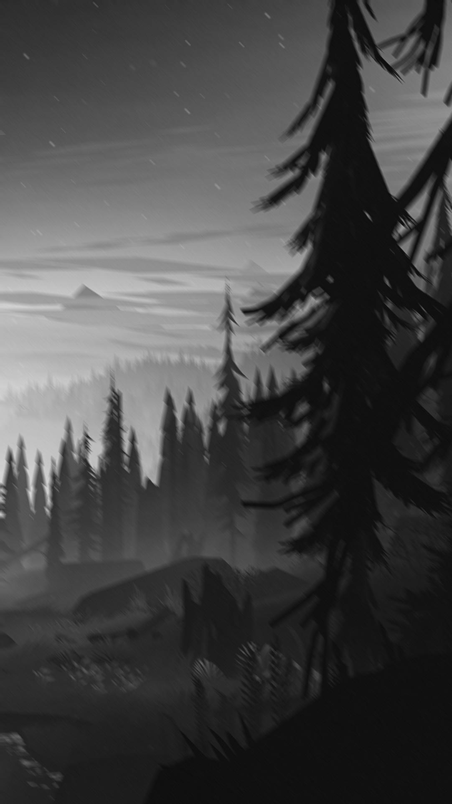

# Motion Blur

## Description
This is a little project I made to learn more about image processing, and graphics in general. Everything is 100% Python, with my own original code! No tutorials used!


## Features
1. Customizable grid size, from 2x2 to n! But do note, the bigger the grid, the longer it takes to process!
2. Batch File Scanning, just enter all the images you want to be processed into the /input directory, and run main.py!

## Installation
1. Clone or Download the code
2. Create a virtual enviroment (optional)
3. Run the following command:
   ```bash
   pip install -r requirements.txt
   ```

## How to use
1. Input all your image files you want to be processed into the `input` folder
2. Run:
   ```bash
   python main.py
   ```
3. Wait for all the images to process
4. See the finished results in the `output` folder

## Results

Original:


After:



This project is licensed under the __[MIT License](LICENSE)__.
